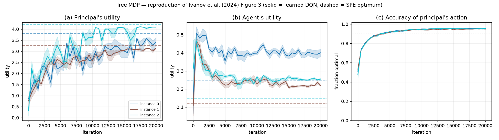
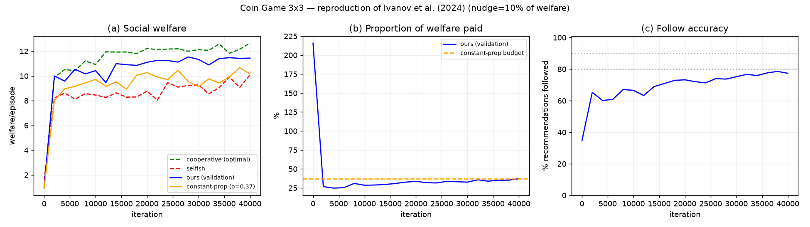

# Reproducing *Principal-Agent Reinforcement Learning* (Ivanov et al., 2024)

A from-scratch reproduction of the experiments in:

> **Dima Ivanov, Paul Dütting, Inbal Talgam-Cohen, Tonghan Wang, David C. Parkes.**
> *Principal-Agent Reinforcement Learning: Orchestrating AI Agents with Contracts* (2024).
> [arXiv:2407.18074](https://arxiv.org/abs/2407.18074)

The authors released **no code**, so everything here is built from the paper and its
appendices. Every under-specified detail we had to decide ourselves is recorded in
[`notes/decision_log.md`](notes/decision_log.md) — that log is as much a part of this work as
the code.

---

## What's reproduced

| Experiment | Paper | This repo |
|---|---|---|
| **1 — Tree MDP** (single-agent, tabular DQN) | Fig. 3 | [`experiments/Tree_MDP`](experiments/Tree_MDP) |
| **2 — Coin Game** (multi-agent, VDN) | Figs. 2 / 4 | [`experiments/Coin_Game`](experiments/Coin_Game) |

We reproduce the paper's **full-scale Tree MDP** (Fig. 3) and the **3×3 Coin Game** (their
Appendix D.2 / Fig. 4 setting). The headline 7×7 Coin Game is left out — it needs GPU-scale
compute (see [Limitations](#limitations)).

### Experiment 1 — Tree MDP



A DQN implementation of the contract meta-algorithm (their Algorithm 2) converges to the exact
subgame-perfect (SPE) optimum, computed by dynamic programming.

| Metric | Paper | Ours |
|---|---|---|
| Action accuracy | ~90% | **~95%** |
| Principal utility (vs SPE optimum) | ~98% | ~90–97% |

### Experiment 2 — Coin Game (3×3)



Independent self-interested learners, offered contracts by a principal trained via VDN,
converge to *following the recommendations* — achieving near-cooperative social welfare at a
fraction of the payment, and **beating the constant-proportion baseline at equal budget**
(the paper's central multi-agent claim).

| Metric | Paper | Ours |
|---|---|---|
| Welfare vs optimal | near-optimal | ~11.4 / 12.5 |
| Beats constant-prop at equal budget | yes | **yes** |
| Payment proportion | ~30% | ~37% |
| Follow accuracy | 80–90% | ~78% |

---

## Method in brief

A **bi-level meta-algorithm** alternates two learners:

- **Agent** learns a *truncated* Q-function `Q̄(s,a)` — its utility *excluding* the immediate
  contract payment. The full Q is recovered by adding back the expected payment.
- **Principal** solves, per state, a **linear program** (closed-form in the binary tree case)
  for the cheapest non-negative payment vector (limited liability) that makes a target action
  **incentive-compatible**, then Q-learns over those optimal contracts.

The principal's utility is *discontinuous* in the contract (underpay by ε → the agent flips
action), so the paper adds **nudging** — a strict-preference margin on the IC constraints —
which we implement and rely on. The multi-agent case adds VDN, shared-parameter agents, and a
tractable dominant-strategy (IC) approximation via per-episode "follow" bits `f_i`.

See the [decision log](notes/decision_log.md) and [Coin Game spec](notes/coin_game_spec.md)
for the full derivation-to-code mapping.

---

## Repository layout

```
src/                        shared engine (Tree MDP)
  tree_mdp.py               random binary game-tree environment (paper's generative model)
  contract.py               LP contract solver + closed-form binary contract (Eq. 3)
  exact.py                  exact SPE solver by backward induction (the DP "optimum")
  dqn.py                    MLP Q-network + replay buffer
experiments/
  Tree_MDP/
    train_tree.py           Algorithm 2 (DQN) + exact-oracle validation
    run_fig3.py             3 instances × 5 trials → Figure 3
    calibrate.py            (diligence artifact; superseded by the paper's exact recipe)
    results/                fig3.png, fig3_data.pkl
  Coin_Game/
    coin_game.py            the 2-player Coin Game (social dilemma)
    networks.py             conv Q-networks + replay
    train_coin.py           Algorithm 3 (VDN training + from-scratch-DQN validation)
    baselines.py            selfish / cooperative / constant-proportion
    run_fig2.py             full pipeline → Figure 2
    results/                fig2.png, fig2_data.pkl
notes/
  decision_log.md           every under-specified choice we made, with reasoning
  coin_game_spec.md         verbatim Coin Game spec extracted from the paper
```

---

## Setup

```bash
pip install -r requirements.txt
```

CPU-only; no GPU required for any experiment in this repo. (PyTorch, NumPy, SciPy, matplotlib.)

## Running

```bash
# Experiment 1 — Tree MDP
python experiments/Tree_MDP/train_tree.py --smoke          # quick sanity run
python experiments/Tree_MDP/run_fig3.py                    # full Figure 3 (~50 min CPU)

# Experiment 2 — Coin Game (3×3)
python experiments/Coin_Game/train_coin.py --smoke         # quick two-phase sanity run
python experiments/Coin_Game/run_fig2.py --nudge-frac 0.1  # full Figure 2 (~40 min CPU)

# replot from saved data without re-running
python experiments/Tree_MDP/run_fig3.py --plot-only
python experiments/Coin_Game/run_fig2.py --plot-only
```

---

## Limitations

An honest accounting — this reproduces the paper's **claims and qualitative results**, not
every number to the decimal:

- **Not bit-exact.** The authors never published seeds; we match their setup and reported
  figures, not identical trees/trajectories.
- **Tree MDP uses a small nudge** the paper reports it did not need. Nudging *is* part of their
  method (and mandatory for the Coin Game), so this is an implementation-quality difference,
  not a methodological one. See decision-log D-10/D-11.
- **Coin Game is undertrained (40k vs the paper's 1,000,000 iterations), 3×3, single-seed —
  all due to compute budget.** This machine is **CPU-only (no GPU)**; the full **1M iterations**
  is ~3.6 hrs *per phase*, and the headline **7×7** grid plus multi-seed error bars were out of
  reach. Our validation follow-rate was **still rising at 40k** (not converged) — see
  [`notes/followrate_investigation.md`](notes/followrate_investigation.md) — so this 25×
  undertraining is a documented, expected contributor to the follow-rate gap. The 3×3 grid *is*
  a setting the paper itself reports (Appendix D.2 / Fig. 4). **The Tree MDP, by contrast,
  matches the paper's stated 20,000 iterations exactly** — and reproduces closely. Experiment 1
  uses the paper's full 3 instances × 5 trials; Experiment 2 is single-seed.
- **Coin Game uses uniform replay**; the paper uses prioritized replay. This likely explains
  the payment-efficiency gap documented in
  [`notes/followrate_investigation.md`](notes/followrate_investigation.md).
- **Coin Game follow-accuracy is nudge-controlled.** At the paper's 10% nudge our follow-rate
  is **~73–77%** (still rising — undertrained), vs the paper's ~90%; a larger nudge reaches
  80–90% at a higher payment cost — see the [nudge sweep](notes/followrate_investigation.md).
- **Fig. 2 panels (d) SPE-ratio and (e) IC-ratio are not yet implemented.**

We hit — and fixed — a genuine training divergence in the multi-agent case (Huber loss +
gradient clipping + target-network contracts). The target-network contract is a departure from
Algorithm 3 line 14 (which uses the online net); see the decision log and
[`notes/followrate_investigation.md`](notes/followrate_investigation.md).

---

## Reference

Ivanov, Dütting, Talgam-Cohen, Wang, Parkes (2024). *Principal-Agent Reinforcement Learning:
Orchestrating AI Agents with Contracts.* arXiv:2407.18074. The paper PDF is **not** included
here — read it on [arXiv](https://arxiv.org/abs/2407.18074).
