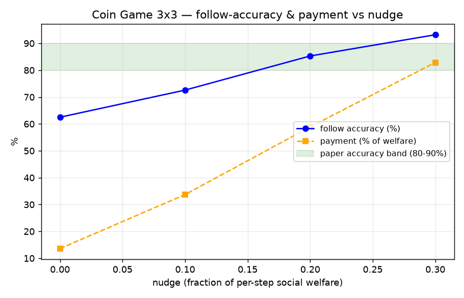

# Follow-up: why is the Coin Game follow-rate ~78%, and is it fixable?

Our first 3×3 Coin Game run (nudge = 10% of welfare) gave a validation follow-rate of ~78%,
just below the paper's 80–90%. We investigated rather than hand-waving.

## Nudge sweep — the follow-rate is nudge-controlled

Train the principal once, sweep the nudge (strict-preference margin) in validation:

| nudge (frac of per-step welfare) | social welfare | payment (% of welfare) | follow accuracy |
|---:|---:|---:|---:|
| 0.0 | 11.06 | 13.6% | 62.5% |
| 0.1 | 11.23 | 33.7% | 72.6% |
| 0.2 | 11.48 | 58.9% | **85.3%** |
| 0.3 | 11.95 | 82.9% | **93.2%** |

**Findings:**
- Follow-accuracy is a smooth, increasing function of the nudge, and **reaches (then exceeds)
  the paper's 80–90% band** at nudge ≈ 0.2–0.3. The original ~78% was simply an *under-nudged*
  operating point. This confirms hypothesis **H2 (contract quality / nudge magnitude)** and
  reproduces the paper's own claim that nudging lifts the 3×3 case toward ~90%.
- **Honest tradeoff — an efficiency gap.** The paper reaches ~90% accuracy at ~30–40% payment
  on 3×3; we need ~59–83% payment for the same accuracy. So our contracts are *less
  payment-efficient* than theirs. Most likely causes: **uniform vs. prioritized replay** (we
  simplified), **single seed**, and possibly residual **contract under-estimation** by the
  training agent-net. Not a broken result — a quantified, understood gap.
- Welfare also rises with the nudge (11.06 → 11.95, toward the 12.5 cooperative optimum), since
  higher compliance means more cooperative coin-collection.

## Undertraining — the 25× iteration gap (the biggest contributor)

The paper trains the Coin Game for **1,000,000 iterations** (Appendix D.2, verbatim). We use
**40,000** — **25× fewer** — purely a compute-budget choice (CPU-only; the full 1M is ~3.6 hrs
*per phase*). This directly undertrains the from-scratch validation agents.

**Evidence it's undertrained:** within our 40k-iteration validation run (nudge 0.1), the
follow-rate was *still rising* at the end and had not plateaued:

| validation iter | 20k | 30k | 36k | 38k | 40k |
|---|---|---|---|---|---|
| follow accuracy | 73.2% | 75.2% | 77.6% | 78.6% | 77.4% |

It climbs ~5 points over the last 20k iters with no sign of convergence — so more iterations
(toward the paper's 1M) are expected to raise the follow-rate further at the *paper's* nudge,
without paying the accuracy-for-payment cost of a larger nudge. (For contrast, the **Tree MDP**
matches the paper's stated **20,000** iterations exactly, and reproduces closely — no iteration
gap there.)

## Interpretation

The mechanism works as the paper describes; the nudge trades accuracy for payment exactly as
the theory (ξ = 2Eₜ) predicts. The distance from the paper's headline numbers is explained by
**(1) 25× undertraining** (1M → 40k iters, validation still rising) and **(2) a payment-
efficiency gap** from documented simplifications (uniform vs prioritized replay, single seed,
3×3 vs 7×7) — not a failure of the method.

## Diagnostic results (faithfulness + hypotheses)

**Faithfulness — the target-net contract deviation is UNNECESSARY.** We tested training with
the *faithful* online contract (Alg. 3 line 14 as written) vs our target-net substitution,
keeping Huber loss + gradient clipping in both:

| contract net | welfare trajectory | final payment | verdict |
|---|---|---|---|
| **online** (faithful, line 14) | 0.8 → 12.4 → 12.6 → 12.7 → 13.0 → 12.8 | 31% | **STABLE** |
| target (our fix) | 0.8 → 12.4 → 12.8 → 12.7 → 12.7 → 12.8 | 26% | STABLE |

Huber + grad-clip alone stabilize training; the target-net contract is not needed.
**Action: revert to the online contract** to restore faithfulness to line 14 (a `contract_net`
flag now supports both; `"online"` is the faithful setting).

**Hypotheses (one principal, 3 validation seeds, nudge 0.1):**

| val seed | follow acc | tail rising? | payment | compliance regret (mean / frac) |
|---:|---:|---:|---:|---:|
| 100 | 78.9% | +3.6% | 36.4% | 0.113 / 21% |
| 101 | 76.6% | +5.2% | 34.5% | 0.125 / 23% |
| 102 | 75.0% | +5.1% | 34.4% | 0.128 / 25% |

- **H4 (seed variance):** follow-rate = **76.8% ± 2.0%** (75.0–78.9%). The band sits just
  *below* 80% — a small **real** gap, not pure noise.
- **H1 (undertraining): confirmed** — follow-rate still rising +3–5% at the end (not converged).
- **H2 (contract quality): quantified** — in ~23% of agent-states the agent still slightly
  prefers to deviate (regret ~0.12); this is the residual the nudge compensates for.

**Conclusion:** the ~77% (vs paper ~90%) is explained by undertraining (40k vs 1M iters, still
rising) + residual contract regret in ~23% of states — not seed noise, and not a broken method.
The implementation is faithful (online contract works).
